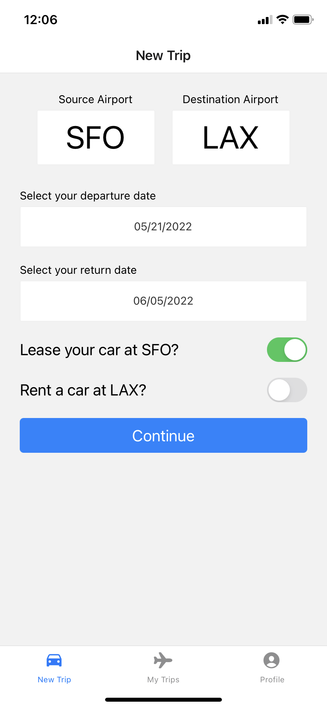
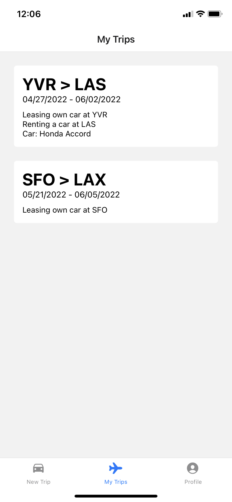
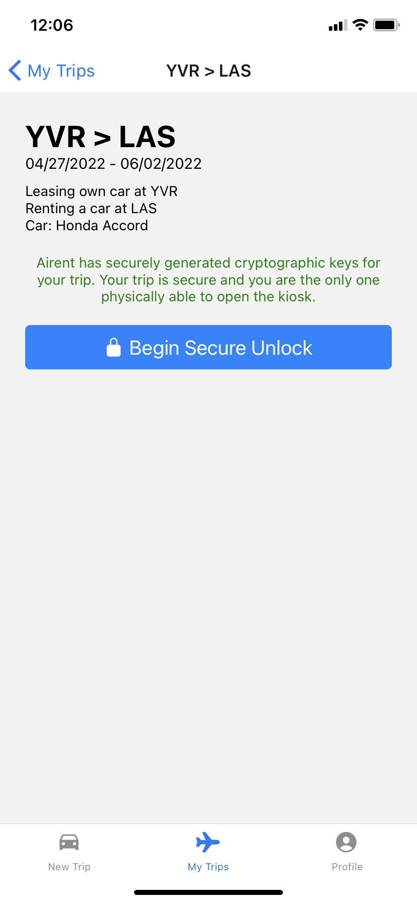

# Airent - INDENG 185-004 Project Code Submission
This repository contains 4 separate facets: Airent's frotend, backend, matching algorithm, and test data.

## App
The app was created in React native and is available cross-platform. The prototype is fully functional and users are easily able to create trips and view trip data. The code does not yet connect to the backend, but is planned for the near future. Due to a lack of hardware, we were unable to create the cryptographic keypair exchange between the kiosk and the app, but this will be implemented using an on-device wallet, taking advantage of NFC technologies in modern phones.

### Demo
[Click here to view demo](https://www.youtube.com/embed/TOetN3hkpUM)

### Screenshots
#### New Trip

#### My Trips

#### Trip Detail

#### Profile

## Backend
This is just a barebones layout of what the backend API will look like, with all the routes planned out. The Node.js/express routes exist and are functional, but the actual routes are just pseudo-code at the moment.

## Matching Algorithm
Our algorithm is used to recommend cars to users. When we have a larger dataset, we will be able to use an ML model. For now, we used a variation of the Game and Shapely algorithm, used by Airbnb, to achieve a Pareto efficient matching. We took dates and airport as a requirement and then according to the preferred car type, created a list of preferences for each user.

## Test Data
We will be using this test data to create our database schemas, and we have based our matching algorithm, backend, and frontend data inputs off of this test data.
